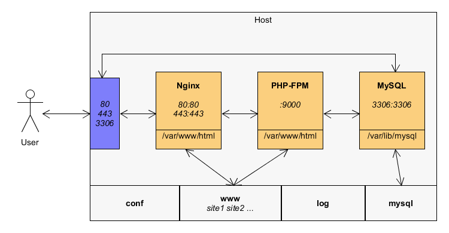
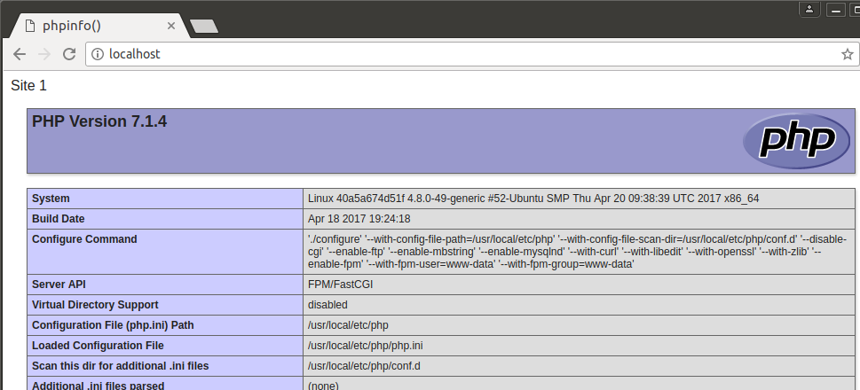

Docker deploying Nginx MySQL PHP7/PHP5.6/PHP5.4 in one key, support full feature functions.

**[[中文说明]](README.md)**



## 1. Feature
1. Completely open source.
2. Support Multiple PHP version(PHP5.4, PHP5.6, PHP7.2) switch.
3. Support Multiple domains.
4. Support HTTPS and HTTP/2.
5. PHP source located in host.
6. MySQL data directory in host.
7. All conf files located in host.
8. All log files located in host.
9. Built-in PHP extensions install commands.
10. Promise 100% available.
11. Supported any OS with docker.

## 2. Usage
1. Install `git`, `docker` and `docker-compose`;
2. Clone project:
    ```
    $ git clone https://github.com/yeszao/dnmp.git
    ```
3. Add current user to group `docker`：
    ```
    $ sudo gpasswd -a ${USER} docker
    ```
4. Start docker containers:
    ```
    $ cd dnmp
    $ cp env.sample .env       # Use copy command on Windows
    $ docker-compose up
    ```
    You may need use `sudo` before this command in Linux.
5. Go to your browser and type `localhost`, you will see:



The index file is located at `./www/localhost/index.php`.


## 3.Multiple php version
Default, we create 3 php container, they are PHP7.2, PHP5.6 and PHP5.4,

We can change easy by modify Nginx configuration `fastcgi_pass`.

For example, [http://localhost](http://localhost) use PHP5.4, Nginx `fastcgi_pass` is:
```
    fastcgi_pass   php54:9000;
```
To use PHP7.2, change it:
```
    fastcgi_pass   php72:9000;
```
Then reload nginx:
```bash
$ docker exec -it dnmp_nginx_1 nginx -s reload
```
Done.

## 4.Use composer
We will always use composer in host.

On host, Create a folder for saving composer config file and cache:
```
mkdir ~/dnmp/composer
```
Open ~/.bashrc, add:
```
composer () {
    tty=
    tty -s && tty=--tty
    docker run \
        $tty \
        --interactive \
        --rm \
        --user $(id -u):$(id -g) \
        --volume ~/dnmp/composer:/tmp \
        --volume /etc/passwd:/etc/passwd:ro \
        --volume /etc/group:/etc/group:ro \
        --volume $(pwd):/app \
        composer "$@"
}
```
Make this script affect:
```
source ~/.bashrc
```
Thats all, use composer:
```
cd ~/dnmp/www/
composer create-project yeszao/fastphp project --no-dev
```

## License
MIT
